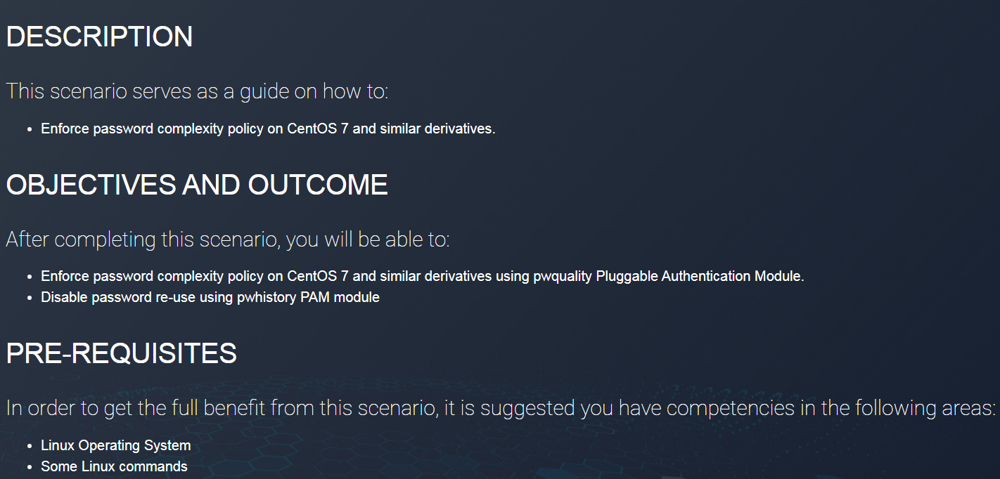

# 🔐 Password Complexity Policy — Certificate (CYRUS)

This repository contains **notes, hands-on labs, research, extras, and the certificate of attendance** for the *Password Complexity Policy* program delivered by **CYRUS**. The material focuses on designing, implementing, testing, and operationalizing strong password policies and related defenses (MFA, lockout, password managers).

---

## 📚 Docs
- 📄 [policy-overview.md](./docs/policy-overview.md) — Policy objectives, standards comparison (NIST/ISO/PCI/CIS)  
- 📄 [implementation-guide.md](./docs/implementation-guide.md) — Practical implementation examples for Windows, Linux (PAM), macOS, LDAP/AD  
- 📄 [testing-methods.md](./docs/testing-methods.md) — Methods to test policy strength (hashcat, JtR, dictionary, hybrid)  
- 📄 [best-practices.md](./docs/best-practices.md) — User guidance, MFA guidance, enterprise deployment tips  
- 📄 [references.md](./docs/references.md) — Standards, tools, and further reading

---

## 🧪 Labs
- 🔧 [lab1-basic-policy-setup.md](./labs/lab1-basic-policy-setup.md) — Create and test a baseline password policy (min length, complexity)  
- 🔧 [lab2-advanced-policy-testing.md](./labs/lab2-advanced-policy-testing.md) — Add blacklist and stronger rules; simulate dictionary attacks  
- 🔧 [lab3-policy-bypass-scenarios.md](./labs/lab3-policy-bypass-scenarios.md) — Check for enforcement gaps and reset-flow bypasses  
- 🔧 [lab4-usability-vs-security.md](./labs/lab4-usability-vs-security.md) — Measure user behavior and trade-offs (strong policy vs usability)

---

## 📝 Notes
- 📄 [introduction.md](./notes/introduction.md) — Course introduction and objectives  
- 📄 [phishing_basics.md](./notes/phishing_basics.md) — Context: why passwords and phishing intersect  
- 📄 [transport_layer.md](./notes/transport_layer.md) — Background on mail transport (contextual reference)  
- 📄 [case_study.md](./notes/case_study.md) — Realistic case study linking policy failure to incident  
- 📄 [conclusion.md](./notes/conclusion.md) — Key takeaways and action plan

---

## 🔬 Research
- 📑 [paper-review.md](./research/paper-review.md) — Summaries/analysis of relevant academic and vendor reports  
- 📑 [experiment-notes.md](./research/experiment-notes.md) — Lab experiment logs, results, and reproducible steps

---

## 📋 Extras
- 📄 [glossary.md](./extras/glossary.md) — Key terms and definitions  
- 📄 [tools_and_commands.md](./extras/tools_and_commands.md) — Useful CLI snippets and tools (hashcat, john, pwquality)  
- 📄 [references.md](./extras/references.md) — Additional reading and links  
- 📄 [best_practices.md](./extras/best_practices.md) — Quick checklist and policy template snippets

---

## 📸 Screenshots

| Step | Screenshot |
|------|------------|
| Course Overview |  |

---

## 📜 Certificate

🎓 [Password-Complexity-Policy-Certificate-Of-Attendance-CYRUS.pdf](./cert/ngvu.thdanh-Password-complexity-policy-Certificate-of-attendance-CYRUS.pdf)  

---

## 📝 Personal Review

This training strengthened my practical understanding of password policy design and testing. The labs show how policy choices impact both security and user behavior; research notes explore testing techniques that quantify resilience to offline/online attacks. Combined, the repository provides both operational guidance and reproducible experiments to validate controls.

---

## ✍️ Author / Maintainer

**Thành Danh** — Red Team Learner & Security Researcher  

- GitHub: [@ngvuthdanhh](https://github.com/ngvuthdanhh)  
- Email: `ngvu.thdanh@gmail.com`

---

## 📄 License

This project is licensed under the **MIT License**. See [LICENSE](./LICENSE) for details.  
© 2025 ngvuthdanhh. All rights reserved.
